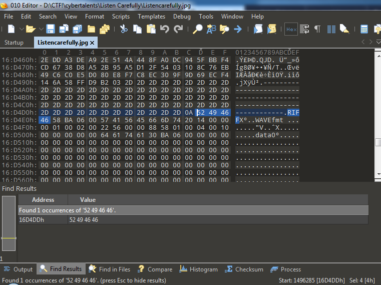

**[Listen Carefully](https://cybertalents.com/challenges/forensics/listen-carefully)**
===================  
[Challenge Link](https://s3-eu-west-1.amazonaws.com/hubchallenges/Forensics/Listen+carefully.jpg)  

> A wanted hacker knew he was going to get arrested, he wanted to save a secret before he was arrested.The police tech team found that this image was the last accessed file. Please help the police find the evidence.

c

When I look at the JPG file I thought it may relate to steg or soemthing as usual I was trying to check couple of things about file:

-  File header   :heavy_check_mark:
-  File type   :heavy_check_mark:
-  Checks for Stego   :heavy_check_mark: 
   * No sucess with various stego tools

After having little brain strom with the file attached to challenge, got something in my mind that challenge name starts with Listen but here we have .jpg.  :worried:

Did something hidden inside the image  :question: 

Lets see what's inside the JPG with Strings, HexDump or any HexEditor (010Editor).

Since string can examine the file and displays huge unknow strings, thought of grep/findstr with string **WAV** OR **WAVE** 

  

Aah!  :exclamation: we have WAVfmt inside JPG file, lets extract WAV from JPG file usnig any hexeditor or hexdump tools.

Lets start with HexEditor and Find the MagicString for WAV ((https://en.wikipedia.org/wiki/List_of_file_signatures) inside the JPG

and I decided to find the Magic String for WAV **52 49 46 46 ?? ?? ?? ?? 57 41 56 45 / RIFF????WAVE**

from there lets copy HEX data and dump to new file and save as <filename>.wav. 
when I strated playing extracted WAv file using VLC Media player I hear distrubing noise, so thought of anyalysnig frequencies with speak.
  
When I Import Exported WAV file to speak it will get docoded frequencies as images, Thats your flag.
  
Note: If you can't see well you can use [Sonic Visualiser](https://sonicvisualiser.org/) for a better analysis

  
  
  
