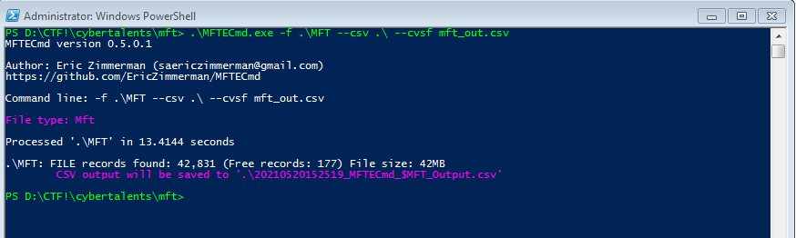
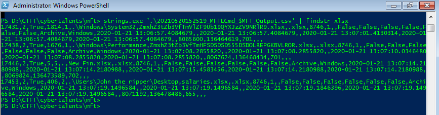
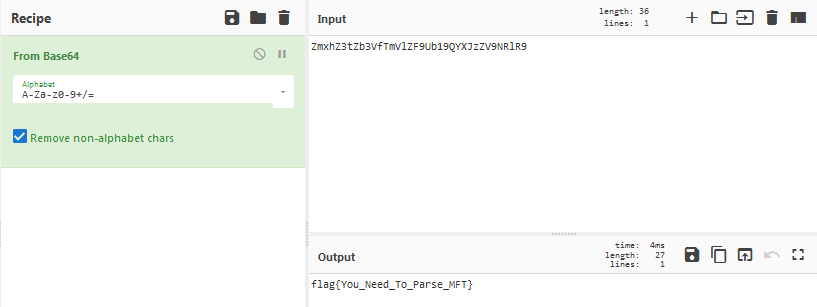

**[MFT](https://cybertalents.com/challenges/forensics/mft)**
===================  
[Challenge Link](https://hubchallenges.s3-eu-west-1.amazonaws.com/Forensics/MFT)

> An incident handler has acquired a MFT file from NTFS partition from an employee workstation  which is suspected to steal excel file sheets so , can you help.

From the description I knew that we need to parse this MFT file, we know that we have couple of tools which can parse, but I prefer to wotk with [Eric Zimmerman's tools](https://ericzimmerman.github.io/#!index.md) 
 
 | Tool | Version | Description |
| --- | --- | --- |
| `MFTECmd` | [0.5.1.0](https://f001.backblazeb2.com/file/EricZimmermanTools/MFTECmd.zip) |  $MFT, $Boot, $J, $SDS, and $LogFile (coming soon) parser. Handles locked files |
| `MFTExplorer` | [1.4.0.0](https://f001.backblazeb2.com/file/EricZimmermanTools/MFTExplorer.zip) |  Graphical $MFT viewer |
 
 AboutDFIR (https://aboutdfir.com/toolsandartifacts/windows/mft-explorer-mftecmd/) published great turotial which may help us to find the flag for current challenge
 
## Lets Start With MTFCmd 
_
Let's examine switch options avaiable with MFTCmd.exe 

MFTECmd version 0.5.0.1

Author: Eric Zimmerman (saericzimmerman@gmail.com)
https://github.com/EricZimmerman/MFTECmd

	f		File to process ($MFT | $J | $LogFile | $Boot | $SDS). Required

	json		Directory to save JSON formatted results to. This or --csv required unless --de or --body is specified
	jsonf		File name to save JSON formatted results to. When present, overrides default name
	csv		Directory to save CSV formatted results to. This or --json required unless --de or --body is specified
	csvf		File name to save CSV formatted results to. When present, overrides default name

	body		Directory to save bodyfile formatted results to. --bdl is also required when using this option
	bodyf		File name to save body formatted results to. When present, overrides default name
	bdl		Drive letter (C, D, etc.) to use with bodyfile. Only the drive letter itself should be provided
	blf		When true, use LF vs CRLF for newlines. Default is FALSE

	dd		Directory to save exported FILE record. --do is also required when using this option
	do		Offset of the FILE record to dump as decimal or hex. Ex: 5120 or 0x1400 Use --de or --vl 1 to see offsets

	de		Dump full details for entry/sequence #. Format is 'Entry' or 'Entry-Seq' as decimal or hex. Example: 5, 624-5 or 0x270-0x5.
	fls		When true, displays contents of directory specified by --de. Ignored when --de points to a file.
	ds		Dump full details for Security Id as decimal or hex. Example: 624 or 0x270

	dt		The custom date/time format to use when displaying time stamps. Default is: yyyy-MM-dd HH:mm:ss.fffffff
	sn		Include DOS file name types. Default is FALSE
	fl		Generate condensed file listing. Requires --csv. Default is FALSE
	at		When true, include all timestamps from 0x30 attribute vs only when they differ from 0x10. Default is FALSE

	vss		Process all Volume Shadow Copies that exist on drive specified by -f . Default is FALSE
	dedupe		Deduplicate -f & VSCs based on SHA-1. First file found wins. Default is FALSE

	debug		Show debug information during processing
	trace		Show trace information during processing
 
	Short options (single letter) are prefixed with a single dash. Long commands are prefixed with two dashes 

> -f inputfile to be pasrsed.
> --csv, --cvsf for outfile which is been parsed.

Lets Parse the file using MTFCmd.exe and produce csv file.

>  **.\MFTECmd.exe -f .\MFT --csv .\ --cvsf mft_out.csv**

Since challenge about finding suspicious excel file so I searched the output csv file for **.xlsx** (the excel files extension).  

I have searched for string 'XLSX usng Strings ( sysInternals )

>  **PS D:\CTF!\cybertalents\mft> strings.exe '.\20210520152519_MFTECmd_$MFT_Output.csv' | findstr xlsx**
>  

I found an xlsx file with a base64-encoded name.

I decided to decoded with [CyberChef](https://gchq.github.io/CyberChef/#recipe=From_Base64('A-Za-z0-9%2B/%3D',true)&input=Wm14aFozdFpiM1ZmVG1WbFpGOVViMTlRWVhKelpWOU5SbFI5). 

