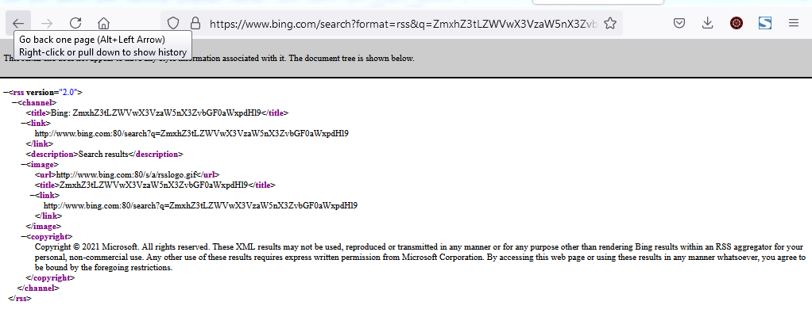

**[Remember Me](https://cybertalents.com/challenges/forensics/remember-me)**
===================  
[Challenge Link](https://hubchallenges.s3-eu-west-1.amazonaws.com/Forensics/remember.zip)

> After acquiring memory from attacker pc we found there is no internet browser except internet explorer . Can you get internet history? 

From the descritpion we have to extract the IE history information from the vmem file, so we use volatility framework along with couple of decoing tools (mostly CyberChef)

 | Tool | Version | Description |
| --- | --- | --- |
| `vol.py` | [2.5](https://www.volatilityfoundation.org/25) | Volatility memory forensics framework |
| `CyberChef` | [9.28.0](https://gchq.github.io/CyberChef/) | CyberChef - The Cyber Swiss Army Knife |

[Volatility Labs](https://volatility-labs.blogspot.com/2012/09/howto-scan-for-internet-cachehistory.html) has published a blog post to extract IE Cache Information, using couple of plug-in like iehistory, yarascan with volatility framework.

## Lets start with gathering basic information about image and imageinfo
after we extract the zip file we have got file with .mem extension which it indicates that it was memory capture artifcat from attcker pc.
lets the image info and os profile using imageinfo plugiin

```
PS D:\CTF!\cybertalents\remember> volatility.exe -f .\remember.mem imageinfo
Volatility Foundation Volatility Framework 2.5
INFO    : volatility.debug    : Determining profile based on KDBG search...
          Suggested Profile(s) : Win7SP0x86, Win7SP1x86
                     AS Layer1 : IA32PagedMemory (Kernel AS)
                     AS Layer2 : FileAddressSpace (D:\CTF!\cybertalents\remember\remember.mem)
                      PAE type : No PAE
                           DTB : 0x185000L
                          KDBG : 0x82949c28L
          Number of Processors : 1
     Image Type (Service Pack) : 1
                KPCR for CPU 0 : 0x8294ac00L
             KUSER_SHARED_DATA : 0xffdf0000L
           Image date and time : 2020-01-20 16:40:00 UTC+0000
     Image local date and time : 2020-01-20 18:40:00 +0200
```
Which imageinfo plugin provided couple of profiles about the host os : we will be selecting Win7SP1x86 profile to get the desired result.

we will try to the run the iehistory plugin to get more information about the IE history

### volatility.exe -f .\remember.mem --profile=Win7SP1x86 iehistory
and piping above command to some txt file to save the outof the iehistory plugin, which given the below input
```
**************************************************
Process: 1424 explorer.exe
Cache type "URL " at 0x1d85000
Record length: 0x100
Location: Visited: John the ripper@http://www.msn.com/?ocid=iehp
Last modified: 2020-01-20 16:37:59 UTC+0000
Last accessed: 2020-01-20 16:37:59 UTC+0000
File Offset: 0x100, Data Offset: 0x0, Data Length: 0xa0
**************************************************
Process: 1424 explorer.exe
Cache type "URL " at 0x1d85100
Record length: 0x100
Location: Visited: John the ripper@http://static-global-s-msn-com.akamaized.net/hp-neu/sc/2b/a5ea21.ico
Last modified: 2020-01-20 16:38:02 UTC+0000
Last accessed: 2020-01-20 16:38:02 UTC+0000
File Offset: 0x100, Data Offset: 0x0, Data Length: 0xc8
**************************************************
Process: 1424 explorer.exe
Cache type "URL " at 0x1d85200
Record length: 0x100
Location: Visited: John the ripper@http://go.microsoft.com/fwlink/?LinkId=69157
Last modified: 2020-01-20 16:38:00 UTC+0000
Last accessed: 2020-01-20 16:38:00 UTC+0000
File Offset: 0x100, Data Offset: 0x0, Data Length: 0xb0
**************************************************
Process: 1424 explorer.exe
Cache type "URL " at 0x1d85300
Record length: 0x180
Location: Visited: John the ripper@http://www.msn.com/ar-eg/?ocid=iehp
Last modified: 2020-01-20 16:39:19 UTC+0000
Last accessed: 2020-01-20 16:39:19 UTC+0000
File Offset: 0x180, Data Offset: 0x0, Data Length: 0xa8
**************************************************
Process: 1424 explorer.exe
Cache type "URL " at 0x1d85480
Record length: 0x100
Location: Visited: John the ripper@https://ieonline.microsoft.com/favicon.ico
Last modified: 2020-01-20 16:38:06 UTC+0000
Last accessed: 2020-01-20 16:38:06 UTC+0000
File Offset: 0x100, Data Offset: 0x0, Data Length: 0xac
**************************************************
Process: 1424 explorer.exe
Cache type "URL " at 0x1d85580
Record length: 0x100
Location: Visited: John the ripper@https://support.microsoft.com/internet-explorer
Last modified: 2020-01-20 16:38:07 UTC+0000
Last accessed: 2020-01-20 16:38:07 UTC+0000
File Offset: 0x100, Data Offset: 0x0, Data Length: 0xb4
**************************************************
Process: 1424 explorer.exe
Cache type "URL " at 0x1d85680
Record length: 0x100
Location: Visited: John the ripper@http://www.bing.com/search?format=rss&q=bing&src=IE-SearchBox&FORM=IE8SRC
Last modified: 2020-01-20 16:39:23 UTC+0000
Last accessed: 2020-01-20 16:39:23 UTC+0000
File Offset: 0x100, Data Offset: 0x0, Data Length: 0xcc
**************************************************
Process: 1424 explorer.exe
Cache type "URL " at 0x1d85780
Record length: 0x100
Location: Visited: John the ripper@http://go.microsoft.com/fwlink/?LinkID=121792
Last modified: 2020-01-20 16:38:08 UTC+0000
Last accessed: 2020-01-20 16:38:08 UTC+0000
File Offset: 0x100, Data Offset: 0x0, Data Length: 0xb0
**************************************************
Process: 1424 explorer.exe
Cache type "URL " at 0x1d85880
Record length: 0x180
Location: Visited: John the ripper@http://www.bing.com/search?format=rss&q=ZmxhZ3tLZWVwX3VzaW5nX3ZvbGF0aWxpdHl9&qs=ds&form=QBRE
Last modified: 2020-01-20 16:39:29 UTC+0000
Last accessed: 2020-01-20 16:39:29 UTC+0000
File Offset: 0x180, Data Offset: 0x0, Data Length: 0xe0
**************************************************
Process: 1424 explorer.exe
Cache type "URL " at 0x1d85a00
Record length: 0x180
Location: Visited: John the ripper@http://www.bing.com/search?q=bing&src=IE-SearchBox&FORM=IE8SRC
Last modified: 2020-01-20 16:39:40 UTC+0000
Last accessed: 2020-01-20 16:39:40 UTC+0000
File Offset: 0x180, Data Offset: 0x0, Data Length: 0xc0
**************************************************
Process: 1424 explorer.exe
Cache type "URL " at 0x1d85b80
Record length: 0x200
Location: Visited: John the ripper@https://www.google.com/search?q=ZmxhZ3tLZWVwX3VzaW5nX3ZvbGF0aWxpdHl9&hl=ar&gbv=1&source=lnms&tbm=vid&sa=X&ved=0ahUKEwjo5-3uzpLnAhUhyIUKHci4BkUQ_AUIBSgB
Last modified: 2020-01-20 16:39:40 UTC+0000
Last accessed: 2020-01-20 16:39:40 UTC+0000
File Offset: 0x200, Data Offset: 0x0, Data Length: 0x11c
**************************************************
Process: 1424 explorer.exe
Cache type "URL " at 0x1d85d80
Record length: 0x200
Location: Visited: John the ripper@https://www.google.com/search?q=ZmxhZ3tLZWVwX3VzaW5nX3ZvbGF0aWxpdHl9&hl=ar&gbv=1&tbm=isch&source=lnms&sa=X&ved=0ahUKEwicxM7wzpLnAhUPyYUKHV8bByYQ_AUIBigC
Last modified: 2020-01-20 16:39:40 UTC+0000
Last accessed: 2020-01-20 16:39:40 UTC+0000
File Offset: 0x200, Data Offset: 0x0, Data Length: 0x11c
**************************************************
Process: 1424 explorer.exe
Cache type "URL " at 0x1d85f80
Record length: 0x180
Location: Visited: John the ripper@http://www.msn.com/ar-eg/?ocid=iehp
Last modified: 2020-01-20 16:39:40 UTC+0000
Last accessed: 2020-01-20 16:39:40 UTC+0000
File Offset: 0x180, Data Offset: 0x0, Data Length: 0xa8
**************************************************
Process: 1424 explorer.exe
Cache type "URL " at 0x1d86180
Record length: 0x180
Location: Visited: John the ripper@https://support.microsoft.com/hub/4230784/internet-explorer-help
Last modified: 2020-01-20 16:38:10 UTC+0000
Last accessed: 2020-01-20 16:38:10 UTC+0000
File Offset: 0x180, Data Offset: 0x0, Data Length: 0xc4
**************************************************
Process: 1424 explorer.exe
Cache type "URL " at 0x1d86300
Record length: 0x380
Location: Visited: John the ripper@https://www.google.com/search?hl=ar&source=hp&q=ZmxhZ3tLZWVwX3VzaW5nX3ZvbGF0aWxpdHl9&btnG=%D8%A8%D8%AD%D8%AB+Google%E2%80%8F&iflsig=AAP1E1EAAAAAXiXls8MELNlw57IRayRoA8Q1GBLGI0w3&gbv=1
Last modified: 2020-01-20 16:39:04 UTC+0000
Last accessed: 2020-01-20 16:39:04 UTC+0000
File Offset: 0x380, Data Offset: 0x0, Data Length: 0x138
**************************************************
Process: 1424 explorer.exe
Cache type "URL " at 0x1d86680
Record length: 0x200
Location: Visited: John the ripper@https://www.google.com/search?q=ZmxhZ3tLZWVwX3VzaW5nX3ZvbGF0aWxpdHl9&hl=ar&gbv=1&source=lnms&tbm=vid&sa=X&ved=0ahUKEwjo5-3uzpLnAhUhyIUKHci4BkUQ_AUIBSgB
Last modified: 2020-01-20 16:39:07 UTC+0000
Last accessed: 2020-01-20 16:39:07 UTC+0000
File Offset: 0x200, Data Offset: 0x0, Data Length: 0x11c
**************************************************
Process: 1424 explorer.exe
Cache type "URL " at 0x1d86880
Record length: 0x200
Location: Visited: John the ripper@https://www.google.com/search?q=ZmxhZ3tLZWVwX3VzaW5nX3ZvbGF0aWxpdHl9&hl=ar&gbv=1&tbm=isch&source=lnms&sa=X&ved=0ahUKEwicxM7wzpLnAhUPyYUKHV8bByYQ_AUIBigC
Last modified: 2020-01-20 16:39:09 UTC+0000
Last accessed: 2020-01-20 16:39:09 UTC+0000
File Offset: 0x200, Data Offset: 0x0, Data Length: 0x11c
**************************************************
Process: 1424 explorer.exe
Cache type "URL " at 0x1d86a80
Record length: 0x200
Location: Visited: John the ripper@http://www.bing.com/news/search?q=ZmxhZ3tLZWVwX3VzaW5nX3ZvbGF0aWxpdHl9&FORM=HDRSC4
Last modified: 2020-01-20 16:39:33 UTC+0000
Last accessed: 2020-01-20 16:39:33 UTC+0000
File Offset: 0x200, Data Offset: 0x0, Data Length: 0xd4
**************************************************
Process: 1424 explorer.exe
Cache type "URL " at 0x1d86c80
Record length: 0x200
Location: Visited: John the ripper@http://www.bing.com/videos/search?q=ZmxhZ3tLZWVwX3VzaW5nX3ZvbGF0aWxpdHl9&FORM=HDRSC3
Last modified: 2020-01-20 16:39:32 UTC+0000
Last accessed: 2020-01-20 16:39:32 UTC+0000
File Offset: 0x200, Data Offset: 0x0, Data Length: 0xd8
**************************************************
Process: 1424 explorer.exe
Cache type "URL " at 0x1d86e80
Record length: 0x200
Location: Visited: John the ripper@http://www.bing.com/images/search?q=ZmxhZ3tLZWVwX3VzaW5nX3ZvbGF0aWxpdHl9&FORM=HDRSC2
Last modified: 2020-01-20 16:39:31 UTC+0000
Last accessed: 2020-01-20 16:39:31 UTC+0000
File Offset: 0x200, Data Offset: 0x0, Data Length: 0xd8
**************************************************
Process: 1424 explorer.exe
Cache type "URL " at 0x1d87080
Record length: 0x180
Location: Visited: John the ripper@http://www.bing.com/search?q=ZmxhZ3tLZWVwX3VzaW5nX3ZvbGF0aWxpdHl9&qs=ds&form=QBRE
Last modified: 2020-01-20 16:39:40 UTC+0000
Last accessed: 2020-01-20 16:39:40 UTC+0000
File Offset: 0x180, Data Offset: 0x0, Data Length: 0xd4
**************************************************
Process: 1424 explorer.exe
Cache type "URL " at 0x1d87280
Record length: 0x200
Location: Visited: John the ripper@https://www.google.com/intl/ar/drive
Last modified: 2020-01-20 16:39:33 UTC+0000
Last accessed: 2020-01-20 16:39:33 UTC+0000
File Offset: 0x200, Data Offset: 0x0, Data Length: 0xa8
**************************************************
Process: 1424 explorer.exe
Cache type "URL " at 0x1d88000
Record length: 0x380
Location: Visited: John the ripper@https://www.google.com/search?hl=ar&source=hp&q=ZmxhZ3tLZWVwX3VzaW5nX3ZvbGF0aWxpdHl9&btnG=%D8%A8%D8%AD%D8%AB+Google%E2%80%8F&iflsig=AAP1E1EAAAAAXiXls8MELNlw57IRayRoA8Q1GBLGI0w3&gbv=1
Last modified: 2020-01-20 16:39:40 UTC+0000
Last accessed: 2020-01-20 16:39:40 UTC+0000
File Offset: 0x380, Data Offset: 0x0, Data Length: 0x138
**************************************************
Process: 1424 explorer.exe
Cache type "URL " at 0x1d88380
Record length: 0x180
Location: Visited: John the ripper@https://www.google.com/?gws_rd=ssl
Last modified: 2020-01-20 16:39:40 UTC+0000
Last accessed: 2020-01-20 16:39:40 UTC+0000
File Offset: 0x180, Data Offset: 0x0, Data Length: 0xa4
**************************************************
Process: 1424 explorer.exe
Cache type "URL " at 0x7876000
Record length: 0x300
Location: https://www.microsoft.com/favicon.ico?v2
Last modified: 2015-06-09 04:52:20 UTC+0000
Last accessed: 2020-01-20 16:38:10 UTC+0000
File Offset: 0x300, Data Offset: 0x94, Data Length: 0xa4
File: favicon[1].ico
Data: HTTP/1.1 200 OK

ETag: "1D0A270110F5A00"

X-EdgeConnect-Origin-MEX-Latency: 348

Content-Type: image/x-icon

Content-Length: 17174

Access-Control-Allow-Credentials: true

Access-Control-Allow-Headers: Origin, X-Requested-With, Content-Type, Accept

Access-Control-Allow-Methods: GET, POST, PUT, DELETE, OPTIONS

P3P: CP="ALL IND DSP COR ADM CONo CUR CUSo IVAo IVDo PSA PSD TAI TELo OUR SAMo CNT COM INT NAV ONL PHY PRE PUR UNI"

X-Frame-Options: SAMEORIGIN

TLS_version: tls1

Strict-Transport-Security: max-age=31536000

X-RTag: RT


~U:john the ripper


**************************************************
Process: 1424 explorer.exe
Cache type "URL " at 0x7876300
Record length: 0x180
Location: http://www.bing.com/favicon.ico
Last modified: 2020-01-17 19:48:56 UTC+0000
Last accessed: 2020-01-20 16:38:12 UTC+0000
File Offset: 0x180, Data Offset: 0x88, Data Length: 0x98
File: favicon[1].ico
Data: HTTP/1.1 200 OK

Content-Length: 237

Content-Type: image/x-icon

X-Cache: TCP_HIT

X-MSEdge-Ref: Ref A: F5FA310B972847C1B62BA66AE2D4ECCD Ref B: MRS20EDGE0108 Ref C: 2020-01-20T16:38:12Z


~U:john the ripper


**************************************************
Process: 1424 explorer.exe
Cache type "URL " at 0x7876480
Record length: 0x180
Location: http://www.bing.com/favicon.ico
Last modified: 2020-01-17 19:48:56 UTC+0000
Last accessed: 2020-01-20 16:38:12 UTC+0000
File Offset: 0x180, Data Offset: 0x88, Data Length: 0x98
File: favicon[1].png
Data: HTTP/1.1 200 OK

Content-Length: 237

Content-Type: image/x-icon

X-Cache: TCP_HIT

X-MSEdge-Ref: Ref A: F5FA310B972847C1B62BA66AE2D4ECCD Ref B: MRS20EDGE0108 Ref C: 2020-01-20T16:38:12Z


~U:john the ripper


**************************************************
Process: 1424 explorer.exe
Cache type "URL " at 0x7877000
Record length: 0x200
Location: https://www.google.com/favicon.ico
Last modified: 2019-10-22 18:30:00 UTC+0000
Last accessed: 2020-01-20 16:39:00 UTC+0000
File Offset: 0x200, Data Offset: 0x8c, Data Length: 0x9c
File: favicon[1].ico
Data: HTTP/1.1 200 OK

Content-Type: image/x-icon

X-Content-Type-Options: nosniff

X-XSS-Protection: 0

Alt-Svc: quic=":443"; ma=2592000; v="46,43",h3-Q050=":443"; ma=2592000,h3-Q049=":443"; ma=2592000,h3-Q048=":443"; ma=2592000,h3-Q046=":443"; ma=2592000,h3-Q043=":443"; ma=2592000

Content-Length: 5430


~U:john the ripper


**************************************************
Process: 3084 FTK Imager.exe
Cache type "URL " at 0x32a6000
Record length: 0x300
Location: https://www.microsoft.com/favicon.ico?v2
Last modified: 2015-06-09 04:52:20 UTC+0000
Last accessed: 2020-01-20 16:38:10 UTC+0000
File Offset: 0x300, Data Offset: 0x94, Data Length: 0xa4
File: favicon[1].ico
Data: HTTP/1.1 200 OK

ETag: "1D0A270110F5A00"

X-EdgeConnect-Origin-MEX-Latency: 348

Content-Type: image/x-icon

Content-Length: 17174

Access-Control-Allow-Credentials: true

Access-Control-Allow-Headers: Origin, X-Requested-With, Content-Type, Accept

Access-Control-Allow-Methods: GET, POST, PUT, DELETE, OPTIONS

P3P: CP="ALL IND DSP COR ADM CONo CUR CUSo IVAo IVDo PSA PSD TAI TELo OUR SAMo CNT COM INT NAV ONL PHY PRE PUR UNI"

X-Frame-Options: SAMEORIGIN

TLS_version: tls1

Strict-Transport-Security: max-age=31536000

X-RTag: RT


~U:john the ripper


**************************************************
Process: 3084 FTK Imager.exe
Cache type "URL " at 0x32a6300
Record length: 0x180
Location: http://www.bing.com/favicon.ico
Last modified: 2020-01-17 19:48:56 UTC+0000
Last accessed: 2020-01-20 16:38:12 UTC+0000
File Offset: 0x180, Data Offset: 0x88, Data Length: 0x98
File: favicon[1].ico
Data: HTTP/1.1 200 OK

Content-Length: 237

Content-Type: image/x-icon

X-Cache: TCP_HIT

X-MSEdge-Ref: Ref A: F5FA310B972847C1B62BA66AE2D4ECCD Ref B: MRS20EDGE0108 Ref C: 2020-01-20T16:38:12Z


~U:john the ripper


**************************************************
Process: 3084 FTK Imager.exe
Cache type "URL " at 0x32a6480
Record length: 0x180
Location: http://www.bing.com/favicon.ico
Last modified: 2020-01-17 19:48:56 UTC+0000
Last accessed: 2020-01-20 16:38:12 UTC+0000
File Offset: 0x180, Data Offset: 0x88, Data Length: 0x98
File: favicon[1].png
Data: HTTP/1.1 200 OK

Content-Length: 237

Content-Type: image/x-icon

X-Cache: TCP_HIT

X-MSEdge-Ref: Ref A: F5FA310B972847C1B62BA66AE2D4ECCD Ref B: MRS20EDGE0108 Ref C: 2020-01-20T16:38:12Z


~U:john the ripper


**************************************************
Process: 3084 FTK Imager.exe
Cache type "URL " at 0x32a7000
Record length: 0x200
Location: https://www.google.com/favicon.ico
Last modified: 2019-10-22 18:30:00 UTC+0000
Last accessed: 2020-01-20 16:39:00 UTC+0000
File Offset: 0x200, Data Offset: 0x8c, Data Length: 0x9c
File: favicon[1].ico
Data: HTTP/1.1 200 OK

Content-Type: image/x-icon

X-Content-Type-Options: nosniff

X-XSS-Protection: 0

Alt-Svc: quic=":443"; ma=2592000; v="46,43",h3-Q050=":443"; ma=2592000,h3-Q049=":443"; ma=2592000,h3-Q048=":443"; ma=2592000,h3-Q046=":443"; ma=2592000,h3-Q043=":443"; ma=2592000

Content-Length: 5430


~U:john the ripper


**************************************************
Process: 2120 FTK Imager.exe
Cache type "URL " at 0x3206000
Record length: 0x300
Location: https://www.microsoft.com/favicon.ico?v2
Last modified: 2015-06-09 04:52:20 UTC+0000
Last accessed: 2020-01-20 16:38:10 UTC+0000
File Offset: 0x300, Data Offset: 0x94, Data Length: 0xa4
File: favicon[1].ico
Data: HTTP/1.1 200 OK

ETag: "1D0A270110F5A00"

X-EdgeConnect-Origin-MEX-Latency: 348

Content-Type: image/x-icon

Content-Length: 17174

Access-Control-Allow-Credentials: true

Access-Control-Allow-Headers: Origin, X-Requested-With, Content-Type, Accept

Access-Control-Allow-Methods: GET, POST, PUT, DELETE, OPTIONS

P3P: CP="ALL IND DSP COR ADM CONo CUR CUSo IVAo IVDo PSA PSD TAI TELo OUR SAMo CNT COM INT NAV ONL PHY PRE PUR UNI"

X-Frame-Options: SAMEORIGIN

TLS_version: tls1

Strict-Transport-Security: max-age=31536000

X-RTag: RT


~U:john the ripper


**************************************************
Process: 2120 FTK Imager.exe
Cache type "URL " at 0x3206300
Record length: 0x180
Location: http://www.bing.com/favicon.ico
Last modified: 2020-01-17 19:48:56 UTC+0000
Last accessed: 2020-01-20 16:38:12 UTC+0000
File Offset: 0x180, Data Offset: 0x88, Data Length: 0x98
File: favicon[1].ico
Data: HTTP/1.1 200 OK

Content-Length: 237

Content-Type: image/x-icon

X-Cache: TCP_HIT

X-MSEdge-Ref: Ref A: F5FA310B972847C1B62BA66AE2D4ECCD Ref B: MRS20EDGE0108 Ref C: 2020-01-20T16:38:12Z


~U:john the ripper


**************************************************
Process: 2120 FTK Imager.exe
Cache type "URL " at 0x3206480
Record length: 0x180
Location: http://www.bing.com/favicon.ico
Last modified: 2020-01-17 19:48:56 UTC+0000
Last accessed: 2020-01-20 16:38:12 UTC+0000
File Offset: 0x180, Data Offset: 0x88, Data Length: 0x98
File: favicon[1].png
Data: HTTP/1.1 200 OK

Content-Length: 237

Content-Type: image/x-icon

X-Cache: TCP_HIT

X-MSEdge-Ref: Ref A: F5FA310B972847C1B62BA66AE2D4ECCD Ref B: MRS20EDGE0108 Ref C: 2020-01-20T16:38:12Z


~U:john the ripper


**************************************************
Process: 2120 FTK Imager.exe
Cache type "URL " at 0x3207000
Record length: 0x200
Location: https://www.google.com/favicon.ico
Last modified: 2019-10-22 18:30:00 UTC+0000
Last accessed: 2020-01-20 16:39:00 UTC+0000
File Offset: 0x200, Data Offset: 0x8c, Data Length: 0x9c
File: favicon[1].ico
Data: HTTP/1.1 200 OK

Content-Type: image/x-icon

X-Content-Type-Options: nosniff

X-XSS-Protection: 0

Alt-Svc: quic=":443"; ma=2592000; v="46,43",h3-Q050=":443"; ma=2592000,h3-Q049=":443"; ma=2592000,h3-Q048=":443"; ma=2592000,h3-Q046=":443"; ma=2592000,h3-Q043=":443"; ma=2592000

Content-Length: 5430


~U:john the ripper


**************************************************
Process: 2120 FTK Imager.exe
Cache type "URL " at 0x3225000
Record length: 0x100
Location: Visited: John the ripper@http://www.msn.com/?ocid=iehp
Last modified: 2020-01-20 16:37:59 UTC+0000
Last accessed: 2020-01-20 16:37:59 UTC+0000
File Offset: 0x100, Data Offset: 0x0, Data Length: 0xa0
**************************************************
Process: 2120 FTK Imager.exe
Cache type "URL " at 0x3225100
Record length: 0x100
Location: Visited: John the ripper@http://static-global-s-msn-com.akamaized.net/hp-neu/sc/2b/a5ea21.ico
Last modified: 2020-01-20 16:38:02 UTC+0000
Last accessed: 2020-01-20 16:38:02 UTC+0000
File Offset: 0x100, Data Offset: 0x0, Data Length: 0xc8
**************************************************
Process: 2120 FTK Imager.exe
Cache type "URL " at 0x3225200
Record length: 0x100
Location: Visited: John the ripper@http://go.microsoft.com/fwlink/?LinkId=69157
Last modified: 2020-01-20 16:38:00 UTC+0000
Last accessed: 2020-01-20 16:38:00 UTC+0000
File Offset: 0x100, Data Offset: 0x0, Data Length: 0xb0
**************************************************
Process: 2120 FTK Imager.exe
Cache type "URL " at 0x3225300
Record length: 0x180
Location: Visited: John the ripper@http://www.msn.com/ar-eg/?ocid=iehp
Last modified: 2020-01-20 16:39:19 UTC+0000
Last accessed: 2020-01-20 16:39:19 UTC+0000
File Offset: 0x180, Data Offset: 0x0, Data Length: 0xa8
**************************************************
Process: 2120 FTK Imager.exe
Cache type "URL " at 0x3225480
Record length: 0x100
Location: Visited: John the ripper@https://ieonline.microsoft.com/favicon.ico
Last modified: 2020-01-20 16:38:06 UTC+0000
Last accessed: 2020-01-20 16:38:06 UTC+0000
File Offset: 0x100, Data Offset: 0x0, Data Length: 0xac
**************************************************
Process: 2120 FTK Imager.exe
Cache type "URL " at 0x3225580
Record length: 0x100
Location: Visited: John the ripper@https://support.microsoft.com/internet-explorer
Last modified: 2020-01-20 16:38:07 UTC+0000
Last accessed: 2020-01-20 16:38:07 UTC+0000
File Offset: 0x100, Data Offset: 0x0, Data Length: 0xb4
**************************************************
Process: 2120 FTK Imager.exe
Cache type "URL " at 0x3225680
Record length: 0x100
Location: Visited: John the ripper@http://www.bing.com/search?format=rss&q=bing&src=IE-SearchBox&FORM=IE8SRC
Last modified: 2020-01-20 16:39:23 UTC+0000
Last accessed: 2020-01-20 16:39:23 UTC+0000
File Offset: 0x100, Data Offset: 0x0, Data Length: 0xcc
**************************************************
Process: 2120 FTK Imager.exe
Cache type "URL " at 0x3225780
Record length: 0x100
Location: Visited: John the ripper@http://go.microsoft.com/fwlink/?LinkID=121792
Last modified: 2020-01-20 16:38:08 UTC+0000
Last accessed: 2020-01-20 16:38:08 UTC+0000
File Offset: 0x100, Data Offset: 0x0, Data Length: 0xb0
**************************************************
Process: 2120 FTK Imager.exe
Cache type "URL " at 0x3225880
Record length: 0x180
Location: Visited: John the ripper@http://www.bing.com/search?format=rss&q=ZmxhZ3tLZWVwX3VzaW5nX3ZvbGF0aWxpdHl9&qs=ds&form=QBRE
Last modified: 2020-01-20 16:39:29 UTC+0000
Last accessed: 2020-01-20 16:39:29 UTC+0000
File Offset: 0x180, Data Offset: 0x0, Data Length: 0xe0
**************************************************
Process: 2120 FTK Imager.exe
Cache type "URL " at 0x3225a00
Record length: 0x180
Location: Visited: John the ripper@http://www.bing.com/search?q=bing&src=IE-SearchBox&FORM=IE8SRC
Last modified: 2020-01-20 16:39:40 UTC+0000
Last accessed: 2020-01-20 16:39:40 UTC+0000
File Offset: 0x180, Data Offset: 0x0, Data Length: 0xc0
**************************************************
Process: 2120 FTK Imager.exe
Cache type "URL " at 0x3225b80
Record length: 0x200
Location: Visited: John the ripper@https://www.google.com/search?q=ZmxhZ3tLZWVwX3VzaW5nX3ZvbGF0aWxpdHl9&hl=ar&gbv=1&source=lnms&tbm=vid&sa=X&ved=0ahUKEwjo5-3uzpLnAhUhyIUKHci4BkUQ_AUIBSgB
Last modified: 2020-01-20 16:39:40 UTC+0000
Last accessed: 2020-01-20 16:39:40 UTC+0000
File Offset: 0x200, Data Offset: 0x0, Data Length: 0x11c
**************************************************
Process: 2120 FTK Imager.exe
Cache type "URL " at 0x3225d80
Record length: 0x200
Location: Visited: John the ripper@https://www.google.com/search?q=ZmxhZ3tLZWVwX3VzaW5nX3ZvbGF0aWxpdHl9&hl=ar&gbv=1&tbm=isch&source=lnms&sa=X&ved=0ahUKEwicxM7wzpLnAhUPyYUKHV8bByYQ_AUIBigC
Last modified: 2020-01-20 16:39:40 UTC+0000
Last accessed: 2020-01-20 16:39:40 UTC+0000
File Offset: 0x200, Data Offset: 0x0, Data Length: 0x11c
**************************************************
Process: 2120 FTK Imager.exe
Cache type "URL " at 0x3225f80
Record length: 0x180
Location: Visited: John the ripper@http://www.msn.com/ar-eg/?ocid=iehp
Last modified: 2020-01-20 16:39:40 UTC+0000
Last accessed: 2020-01-20 16:39:40 UTC+0000
File Offset: 0x180, Data Offset: 0x0, Data Length: 0xa8
**************************************************
Process: 2120 FTK Imager.exe
Cache type "URL " at 0x3226180
Record length: 0x180
Location: Visited: John the ripper@https://support.microsoft.com/hub/4230784/internet-explorer-help
Last modified: 2020-01-20 16:38:10 UTC+0000
Last accessed: 2020-01-20 16:38:10 UTC+0000
File Offset: 0x180, Data Offset: 0x0, Data Length: 0xc4
**************************************************
Process: 2120 FTK Imager.exe
Cache type "URL " at 0x3226300
Record length: 0x380
Location: Visited: John the ripper@https://www.google.com/search?hl=ar&source=hp&q=ZmxhZ3tLZWVwX3VzaW5nX3ZvbGF0aWxpdHl9&btnG=%D8%A8%D8%AD%D8%AB+Google%E2%80%8F&iflsig=AAP1E1EAAAAAXiXls8MELNlw57IRayRoA8Q1GBLGI0w3&gbv=1
Last modified: 2020-01-20 16:39:04 UTC+0000
Last accessed: 2020-01-20 16:39:04 UTC+0000
File Offset: 0x380, Data Offset: 0x0, Data Length: 0x138
**************************************************
Process: 2120 FTK Imager.exe
Cache type "URL " at 0x3226680
Record length: 0x200
Location: Visited: John the ripper@https://www.google.com/search?q=ZmxhZ3tLZWVwX3VzaW5nX3ZvbGF0aWxpdHl9&hl=ar&gbv=1&source=lnms&tbm=vid&sa=X&ved=0ahUKEwjo5-3uzpLnAhUhyIUKHci4BkUQ_AUIBSgB
Last modified: 2020-01-20 16:39:07 UTC+0000
Last accessed: 2020-01-20 16:39:07 UTC+0000
File Offset: 0x200, Data Offset: 0x0, Data Length: 0x11c
**************************************************
Process: 2120 FTK Imager.exe
Cache type "URL " at 0x3226880
Record length: 0x200
Location: Visited: John the ripper@https://www.google.com/search?q=ZmxhZ3tLZWVwX3VzaW5nX3ZvbGF0aWxpdHl9&hl=ar&gbv=1&tbm=isch&source=lnms&sa=X&ved=0ahUKEwicxM7wzpLnAhUPyYUKHV8bByYQ_AUIBigC
Last modified: 2020-01-20 16:39:09 UTC+0000
Last accessed: 2020-01-20 16:39:09 UTC+0000
File Offset: 0x200, Data Offset: 0x0, Data Length: 0x11c
**************************************************
Process: 2120 FTK Imager.exe
Cache type "URL " at 0x3226a80
Record length: 0x200
Location: Visited: John the ripper@http://www.bing.com/news/search?q=ZmxhZ3tLZWVwX3VzaW5nX3ZvbGF0aWxpdHl9&FORM=HDRSC4
Last modified: 2020-01-20 16:39:33 UTC+0000
Last accessed: 2020-01-20 16:39:33 UTC+0000
File Offset: 0x200, Data Offset: 0x0, Data Length: 0xd4
**************************************************
Process: 2120 FTK Imager.exe
Cache type "URL " at 0x3226c80
Record length: 0x200
Location: Visited: John the ripper@http://www.bing.com/videos/search?q=ZmxhZ3tLZWVwX3VzaW5nX3ZvbGF0aWxpdHl9&FORM=HDRSC3
Last modified: 2020-01-20 16:39:32 UTC+0000
Last accessed: 2020-01-20 16:39:32 UTC+0000
File Offset: 0x200, Data Offset: 0x0, Data Length: 0xd8
**************************************************
Process: 2120 FTK Imager.exe
Cache type "URL " at 0x3226e80
Record length: 0x200
Location: Visited: John the ripper@http://www.bing.com/images/search?q=ZmxhZ3tLZWVwX3VzaW5nX3ZvbGF0aWxpdHl9&FORM=HDRSC2
Last modified: 2020-01-20 16:39:31 UTC+0000
Last accessed: 2020-01-20 16:39:31 UTC+0000
File Offset: 0x200, Data Offset: 0x0, Data Length: 0xd8
**************************************************
Process: 2120 FTK Imager.exe
Cache type "URL " at 0x3227080
Record length: 0x180
Location: Visited: John the ripper@http://www.bing.com/search?q=ZmxhZ3tLZWVwX3VzaW5nX3ZvbGF0aWxpdHl9&qs=ds&form=QBRE
Last modified: 2020-01-20 16:39:40 UTC+0000
Last accessed: 2020-01-20 16:39:40 UTC+0000
File Offset: 0x180, Data Offset: 0x0, Data Length: 0xd4
**************************************************
Process: 2120 FTK Imager.exe
Cache type "URL " at 0x3227280
Record length: 0x200
Location: Visited: John the ripper@https://www.google.com/intl/ar/drive
Last modified: 2020-01-20 16:39:33 UTC+0000
Last accessed: 2020-01-20 16:39:33 UTC+0000
File Offset: 0x200, Data Offset: 0x0, Data Length: 0xa8
**************************************************
Process: 2120 FTK Imager.exe
Cache type "URL " at 0x3228000
Record length: 0x380
Location: Visited: John the ripper@https://www.google.com/search?hl=ar&source=hp&q=ZmxhZ3tLZWVwX3VzaW5nX3ZvbGF0aWxpdHl9&btnG=%D8%A8%D8%AD%D8%AB+Google%E2%80%8F&iflsig=AAP1E1EAAAAAXiXls8MELNlw57IRayRoA8Q1GBLGI0w3&gbv=1
Last modified: 2020-01-20 16:39:40 UTC+0000
Last accessed: 2020-01-20 16:39:40 UTC+0000
File Offset: 0x380, Data Offset: 0x0, Data Length: 0x138
**************************************************
Process: 2120 FTK Imager.exe
Cache type "URL " at 0x3228380
Record length: 0x180
Location: Visited: John the ripper@https://www.google.com/?gws_rd=ssl
Last modified: 2020-01-20 16:39:40 UTC+0000
Last accessed: 2020-01-20 16:39:40 UTC+0000
File Offset: 0x180, Data Offset: 0x0, Data Length: 0xa4
```
if we observe the output of iehostry plugin we can find that nmost of history is related to John the Ripper Search, but if we observe throughly we got one history entry with bing looks something we need to look at

```
Process: 2120 FTK Imager.exe
Cache type "URL " at 0x3225880
Record length: 0x180
Location: Visited: John the ripper@http://www.bing.com/search?format=rss&q=ZmxhZ3tLZWVwX3VzaW5nX3ZvbGF0aWxpdHl9&qs=ds&form=QBRE
Last modified: 2020-01-20 16:39:29 UTC+0000
Last accessed: 2020-01-20 16:39:29 UTC+0000
File Offset: 0x180, Data Offset: 0x0, Data Length: 0xe0
```
let we open the URL directly into browser which is a RSS feed of bingSearch https://www.bing.com/search?format=rss&q=ZmxhZ3tLZWVwX3VzaW5nX3ZvbGF0aWxpdHl9&qs=ds&form=QBRE 



Lets Use Cyberchef to extract the base64 Strnig from RSS Feed

https://gchq.github.io/CyberChef/#recipe=Magic(3,false,false,''/disabled)From_Base64('A-Za-z0-9%2B/%3D',false)&input=Wm14aFozdExaV1Z3WDNWemFXNW5YM1p2YkdGMGFXeHBkSGw5

### Flag : flag{Keep_using_volatility}
